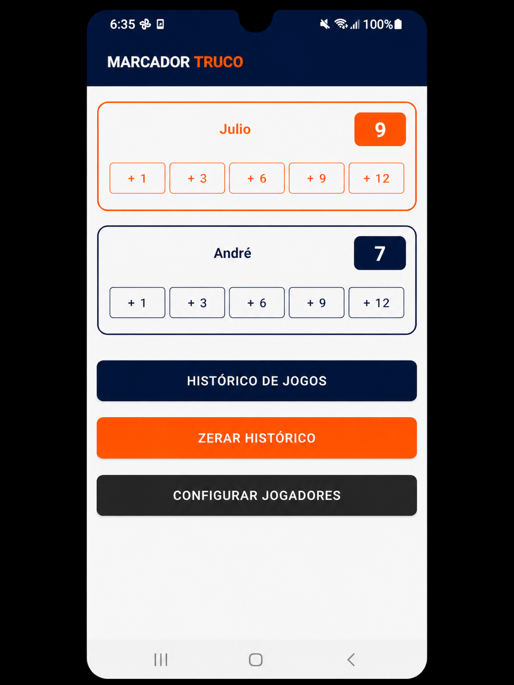
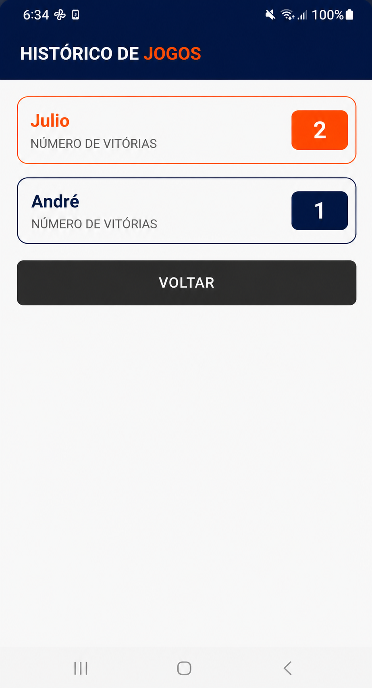
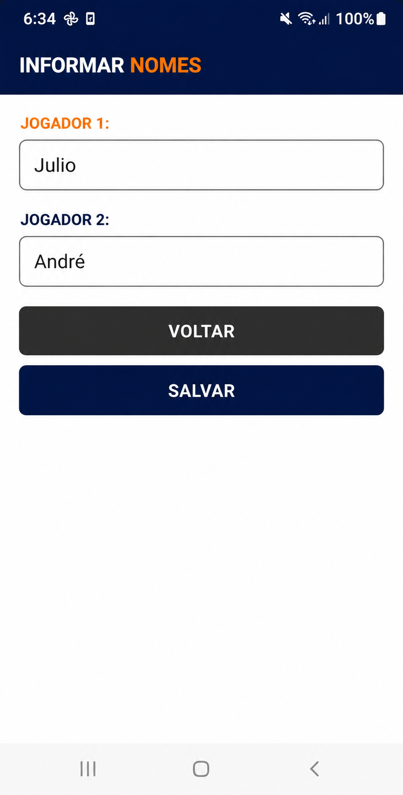

# Marcador de Truco - Projeto Android (UTFPR)

Pós-Mobile, projeto disciplina android basico.

Este aplicativo é um marcador de pontos para jogos de Truco, desenvolvido como avaliação para a disciplina de Programação para Dispositivos Móveis. O projeto segue as diretrizes do Material Design 3 e foca em uma interface limpa, intuitiva e profissional.

---

## 📸 Screenshots

  
  
  

---

## ✅ Requisitos Atendidos

### Questão 1: Interface Visual
*   Desenvolvimento de 3 telas (`MainActivity`, `HistoryActivity`, `PlayersActivity`).
*   Uso de `MaterialCardView` para organização das informações dos jogadores.
*   Identidade visual baseada em cores contrastantes (Azul e Laranja) para facilitar a distinção entre as equipes.

### Questão 2: Lógica de Pontuação
*   Sistema de pontuação incremental (+1, +3, +6, +9, +12).
*   Regra de vitória ao atingir 12 pontos com alerta visual via `AlertDialog`.
*   Reset automático de rodada após a confirmação da vitória.

### Questão 3: Histórico de Jogadas
*   Tela dedicada para visualização do total de partidas ganhas por cada jogador/equipe.
*   Persistência de estado durante a navegação entre as telas.

### Questão 4: Gerenciamento de Nomes
*   Interface para personalização dos nomes dos jogadores.
*   Uso de `ActivityResultLauncher` para garantir a atualização em tempo real dos nomes na tela principal.

### Questão 5: Reset de Histórico
*   Funcionalidade para zerar todas as estatísticas (pontos, vitórias e nomes).
*   Feedback imediato ao usuário via `Toast` informativo.

---

## 🛠 Diferenciais Técnicos

*   **Zero Hardcoded Strings:** Todos os textos do app estão centralizados no `strings.xml`.
*   **Recursos Centralizados:** Cores padronizadas via `colors.xml` e temas integrados com a Barra de Status do sistema.
*   **State Management:** Uso de `onSaveInstanceState` para evitar perda de dados ao rotacionar a tela.
